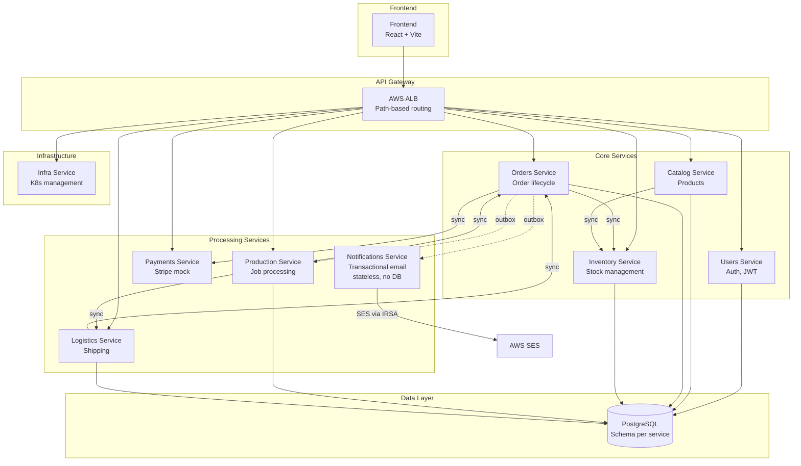
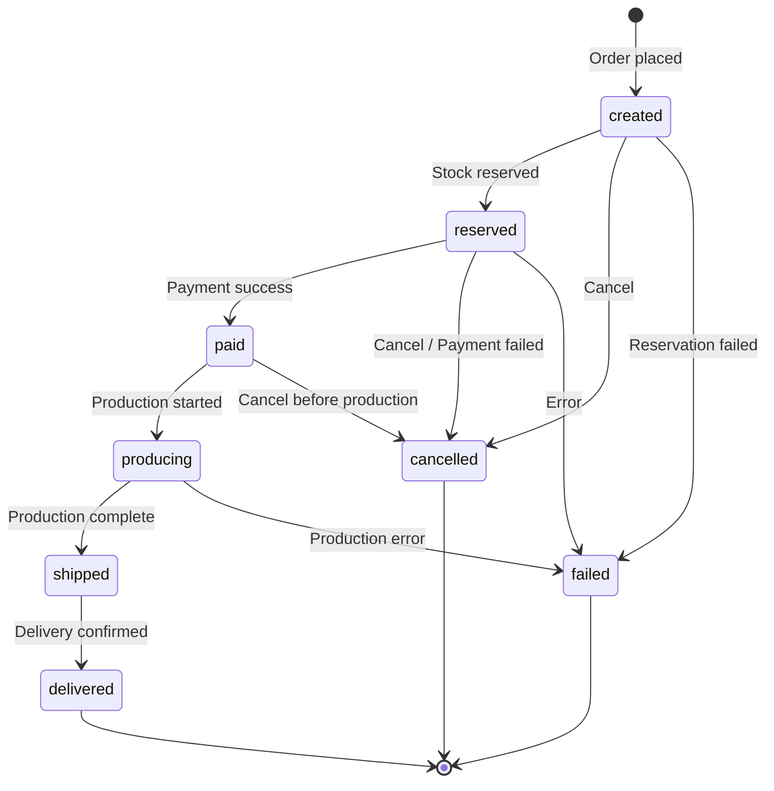
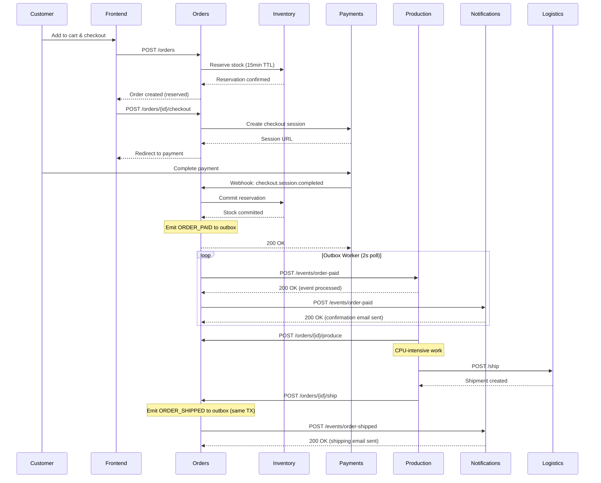
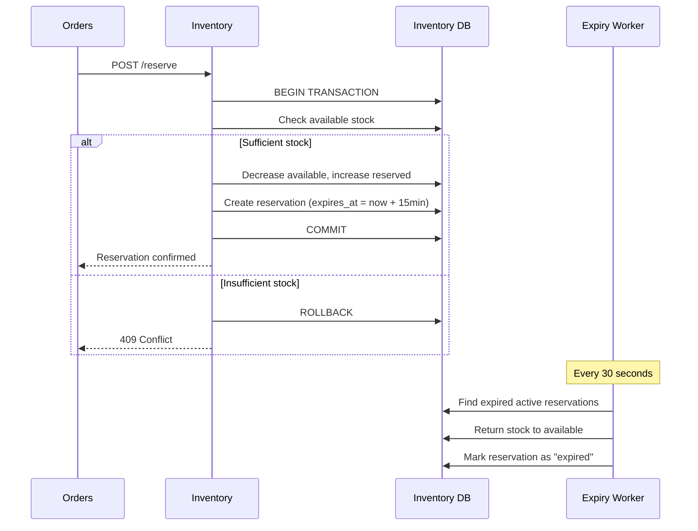
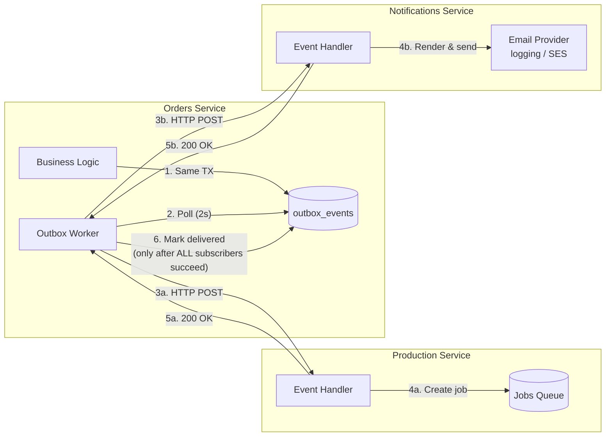
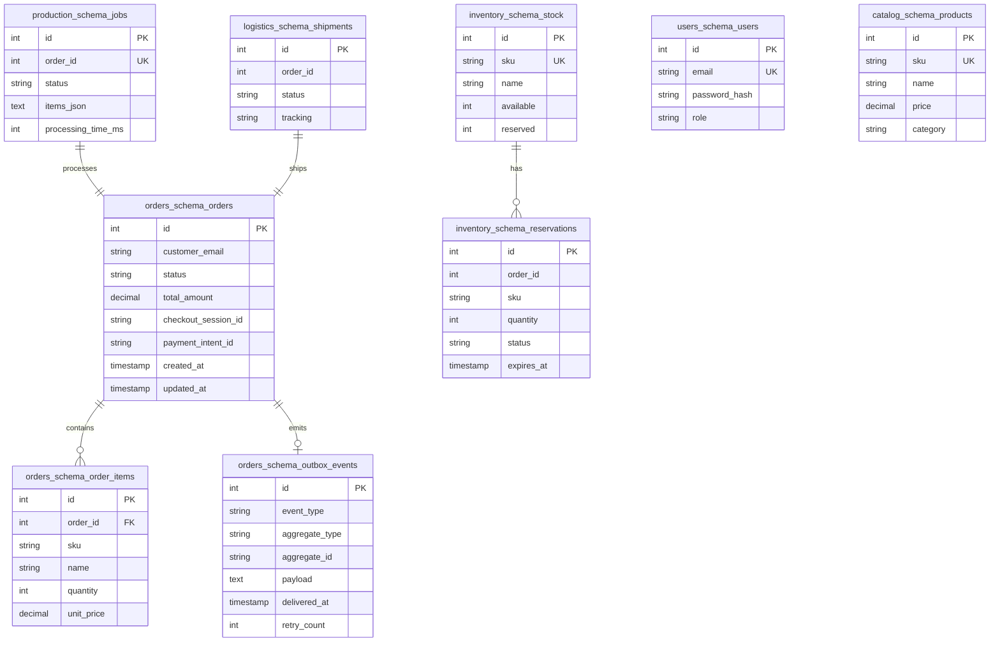
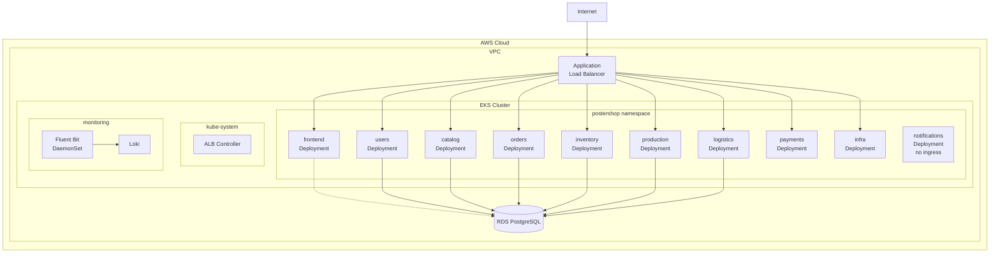
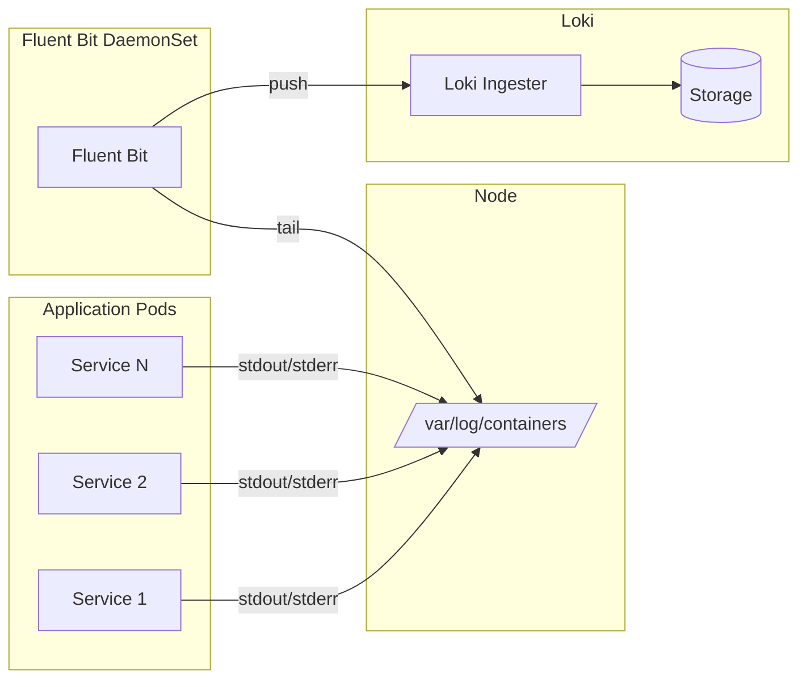

# Architecture Documentation

## System Overview

The shop-platform is a microservices-based e-commerce system for selling custom posters. It demonstrates event-driven architecture patterns including the transactional outbox pattern for reliable messaging.

---

## Service Dependency Diagram



**Notifications has no edge to PostgreSQL.** It is stateless by design: no schema, no
Alembic migrations, no `models.py`. Its only persistent-looking state is an in-memory
set of processed `event_id` values, which is per-replica and lost on restart.

**Notifications is not ALB-exposed.** Its chart sets `ingress.enabled: false`, so it
receives no ALB routing rule and appears in no routing table below. The orders outbox
worker reaches it over cluster-internal DNS (`http://notifications:8000`).

---

## Order Lifecycle State Machine



---

## Checkout & Payment Flow



`ORDER_PAID` fans out to both production and notifications from a single outbox row.
Delivery is sequential within one worker pass, and the retry unit is the whole event
rather than the individual subscriber.

---

## Stock Reservation Flow



---

## Event-Driven Architecture (Outbox Pattern)



Step 6 is the important subtlety: the outbox row is marked delivered only once every
subscriber for that event type has returned success. A failure at any single subscriber
retries the whole event, re-delivering it to subscribers that already succeeded, which is
why every consumer must be idempotent.

---

## Database Schema Overview



---

## Kubernetes Deployment Architecture



---

## Path-Based Routing (ALB Ingress)

| Path Pattern | Service | Port |
|--------------|---------|------|
| `/users/*` | users | 8000 |
| `/catalog/*` | catalog | 8000 |
| `/orders/*` | orders | 8000 |
| `/inventory/*` | inventory | 8000 |
| `/production/*` | production | 8000 |
| `/logistics/*` | logistics | 8000 |
| `/payments/*` | payments | 8000 |
| `/infra/*` | infra | 8000 |
| `/*` (default) | frontend | 80 |

---

## Logging Architecture



**Log Format (JSON):**
```json
{
  "timestamp": "2024-01-15T10:30:00.123Z",
  "level": "INFO",
  "service": "orders",
  "correlation_id": "abc-123-def",
  "message": "Order created",
  "order_id": 42
}
```
